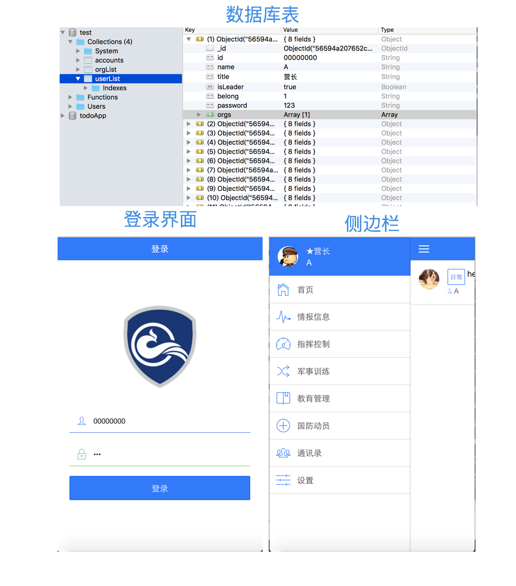

FCWS
======

> FCWS是一个基于Ionic，Nodejs，Mongodb开发的端到端移动应用。要运行该项目，需要首先安装相应的环境，包括Nodejs,Ionic,Mongodb。以下步骤的测试环境为MacOS,其他系统暂未测试。

# 教程

本教程存放在我的[blog](mclspace.com)上，目录如下:
- [目录](http://mclspace.com/2015/11/21/ionic-app-0/)
- [技术综述](http://mclspace.com/2015/11/23/ionic-app-1/)：该项目中所用到的技术知识
- [软件总体架构](http://mclspace.com/2015/11/24/ionic-app-2/)：前后端通信的一个整体框架
- [客户端实现](http://mclspace.com/2015/11/28/ionic-app-3/)：使用Ionic实现客户端 
- [服务器端实现](http://mclspace.com/2015/11/28/ionic-app-4/): 使用Nodejs与Mongodb实现服务器端 

# 运行步骤
首先打开Mongod数据库,默认的数据库名称为test

```
//Mac端命令
$ sudo mongod
```

然后添加测试数据并开启服务器，首先安装node_modules，本工程中的node_modules不一定适合你的系统。

```
$ cd server
$ rm -rf node_modules
$ npm install
```

该系统没有提供注册页面，人员录入通过脚本进行。

```
$ cd server/bin
依次执行以下命令:
$ node users_build.js
$ node orgs_build.js
$ node users_get_orgs_build.js
```
你可以用remongo等工具查看数据库中的test collection中是否已经录入数据。然后开启服务器:

```
$ cd ..
$ node server.js
```

最后运行客户端，同样这个工程里也有node_modules，如果无法运行，删除该文件夹重新安装。

```
$ cd client
$ ionic serve
```
运行成功!

#运行截图

